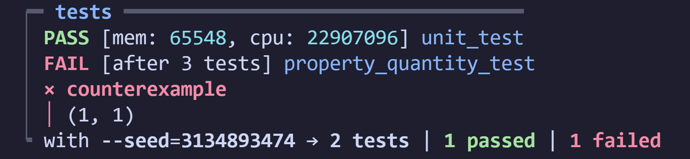

# aiken-test

This is a testing suite for Aiken

This repo is a suite of testing tools for testing smart contracts in akien.



## Unit Testing

A set of helper functions to create unit tests for helper functions and validators.

### Tx

Tx has some basic functions for unit testing and helper functions for building transaction data for your validator tests.

Inputs, Outputs, Script & Wallet Addresses

### Value

Value has some functions for turning Lists or Tuples into Values.

These are good to combine with Fuzzers to create random Values for your validator tests.

## Property Testing

A set of fuzzers to create property tests for helper functions and validators.

### Hash

This module creates lists and tuples of hashes at 28Bytes, which is the length of script hashes, meaning it is perfect for credentials and assets.

### Ints

The Ints module creates lists and tuples of ints between 1-10.

This is to minimise the variation for validator value tests so values used will sometimes match, helping to create failing tests with props.

### Assets

This module is used to create assets and lists of assets from tuple fuzzers.

The tuples are generated into 'flattened' lists of `(policy, name, qty)` and there is a multi asset and singleton available.

---

### WARNING

This testing suite is under development and currently incomplete

---

## Using This Test Suite

To make effective use of this test suite, you will likely need to define your own data structures for Datums and Redeemers, but otherwise you should have everything you need to build unit and property tests for validators.

We specify validator level tests because function tests usually need to be more bespoke, but the validator tests need more specific uniform elements to build the appropriate transaction.

### Validator Unit Tests

Validator unit tests are great for checking validators for expected behaviour and benchmarking.

Because of how PlutusV3 Validators work, this has been made much simpler in the Conway Era.

You will need to create your own Transaction body:

```
let tx =
  Transaction {
    .. placeholder,
    inputs: [in1, in2],
    outputs: [out1, out2],
  }
```

But you can use the available functions to make the ins and outs more easily with a level of granular control that isn't too syntax heavy.

Output:

```
use units/tx as t

let out1 =
  t.output(
    t.walletAddress(#"face"),
    assets.form_lovelace(200),
    NoDatum,
  )
```

Input:

```
use units/tx as t

asset = (#"dead", #"beef", 1)

let in1 =
  t.input(
    t.oref(#"feed", 1),
    t.output(
      t.scriptAddres(#"cafe"),
      t.makeAsset(asset),
      InlineDatum(myDatum)
    )
  )
```

### Property Tests

Property based tests for validators can be done very easily with our props module, and they are great ( in my experience ) to write failing tests.

The reason is that you can expect the validator to fail, and it will only error out if validation passes.

This means you will only get the 'passing' case returned for you to compare, which will allow you to find potential exploits, or verify that it does only work if the expected values are in place.

Generally you will start with a passing unit test and then duplicate it and add a fuzzer to create your property test

```
use props/ints as i

test myPropTest((inAmt, outAmt) via i.twoTens()) fail {
  let inValue = assets.from_lovelace(inAmt)
  let outVAlue = assets.from_lovelace(outAmt)

  ...
}
```

in our example we have a hypothetical validator test.

If we expect the validator to pass when inValue == outValue, then this test should only fail IF the fuzzer generates a matching pair.

Otherwise validaton should fail and so the test will pass.

---

Project notes during development here:
[Notes](./Notes.md)
